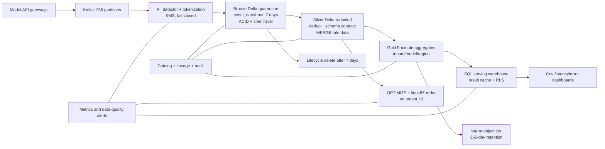

# Architecture brief — LLM observability 1B request/ngày

**Chủ đề:** A — LLM observability ở quy mô 1B requests/ngày  
**Vai trò:** Architect on-call  
**Trạng thái:** Design proposal; các đơn giá dưới đây là giả định lập kế hoạch,
phải được thay bằng báo giá của region và hợp đồng thực tế trước khi phê duyệt.

## 1. Problem statement

Nền tảng model API nhận 1 tỷ request/ngày, trung bình 5 KB/request, tương đương
5 TB raw/ngày và khoảng 58.000 request/giây trung bình; peak giả định gấp 4 lần,
232.000 request/giây. Dashboard theo tenant phải refresh trong 5 phút. Payload
đầy đủ cần giữ 7 ngày để điều tra incident, nhưng PII phải được phát hiện và
token hóa trước khi dữ liệu trở thành lớp mà analyst có thể đọc. Aggregate cần
giữ 365 ngày. Ngân sách object storage là 5.000 USD/tháng.

Khó khăn nằm ở bốn xung đột: throughput cao tạo small files; tenant là khóa lọc
quan trọng nhưng cardinality quá lớn để partition trực tiếp; retention ngắn của
payload phải cùng tồn tại với audit/time travel; và dashboard cần dữ liệu nhanh
trong khi pipeline PII phải fail-closed. Thiết kế phải cho phép replay, sửa lỗi
aggregation và schema evolution mà không làm lộ raw prompt hoặc phá dashboard.
Phạm vi brief gồm ingest, storage, serving và vận hành; không thiết kế model API.

## 2. Kiến trúc đề xuất

Concept Day18 được áp dụng trực tiếp: medallion tách raw/clean/serving; Delta ACID
và time travel cho replay/rollback; schema enforcement chặn drift; evolution chỉ
opt-in; compaction xử lý small files; clustering theo `tenant_id` tạo file
skipping; catalog/lineage ghi phiên bản nguồn; lifecycle và tiering giữ ngân sách.

## 3. Ràng buộc và giả định định lượng

| Hạng mục | Giá trị dùng để thiết kế |
|---|---:|
| Lưu lượng trung bình / peak | 58 K / 232 K events/s |
| Raw logical volume | 5 TB/ngày |
| Bronze lossless compression | 2,5:1 → 2 TB/ngày vật lý |
| Silver sau bỏ trường thừa và redact | 1,2 TB/ngày |
| Gold aggregates | 0,5% raw → 25 GB/ngày |
| Payload retention | 7 ngày |
| Aggregate retention | 365 ngày |
| Dashboard freshness | ≤ 5 phút |
| Storage planning rates | hot 23 USD/TB-tháng; warm 12,5 USD/TB-tháng |
| Compute planning rates | 0,045 USD/vCPU-giờ; 0,005 USD/GB-RAM-giờ |

Các hệ số compression và aggregate phải được đo lại trong MVP. Thiết kế giữ
headroom 4× throughput và 20% storage thay vì coi trung bình là capacity peak.

## 4. Các quyết định chính và alternatives đã loại

### Quyết định 1 — Delta cho ba lớp và catalog trung tâm

Tôi chọn **Delta Lake cho Bronze/Silver/Gold, đăng ký trong catalog trung tâm**.
Transaction log cho atomic append/MERGE, schema enforcement, time travel và
history phù hợp incident review. Cùng một catalog áp row-level security, owner,
retention tag và lineage cho cả ba lớp.

- Tôi loại **Parquet thuần theo prefix** vì không có transaction log; concurrent
  compaction và streaming có thể tạo snapshot không nhất quán, còn rollback phải
  tự quản lý danh sách file.
- Tôi loại **đưa raw trực tiếp vào warehouse proprietary** vì 5 TB/ngày làm chi
  phí ingest/retention gắn với compute warehouse và tăng lock-in. Iceberg vẫn là
  phương án hợp lệ nếu tổ chức chuẩn hóa REST catalog, nhưng trong bài này Delta
  giảm rủi ro triển khai vì MERGE/CDF/OPTIMIZE là đường vận hành chính.

### Quyết định 2 — Streaming medallion với PII gate trước lớp analyst

Tôi chọn **Kafka → PII/tokenization → Bronze quarantine → Silver redacted → Gold**.
Bronze là replay boundary bị khóa cho service principal; analyst chỉ đọc Silver
và Gold. Mỗi event có `event_id`, source offset, `schema_version`, tokenization
version và ingest timestamp.

- Tôi loại **ghi thẳng Gold từ gateway** vì mất raw replay khi logic cost/error
  sai và không thể chứng minh dữ liệu nào tạo dashboard.
- Tôi loại **một bảng duy nhất chứa cả raw và redacted** vì column ACL dễ bị cấu
  hình sai, lifecycle 7 ngày của prompt xung đột retention 365 ngày của aggregate,
  và scan dashboard có nguy cơ đọc blob lớn.

### Quyết định 3 — Partition theo thời gian, cluster theo tenant

Tôi chọn **partition Bronze/Silver theo `event_date` + `event_hour`, Gold theo
`event_date`; cluster/Z-order Silver và Gold theo `tenant_id`, sau đó `model`**.
Thời gian có cardinality hữu hạn và khớp retention. Tenant clustering làm min/max
hẹp để query một tenant bỏ qua phần lớn file mà không tạo hàng triệu partition.
Target file 256–512 MB; streaming ghi staging files rồi compaction mỗi 15 phút.

- Tôi loại **partition trực tiếp theo tenant** vì cardinality cao tạo partition
  rỗng/nhỏ, metadata bùng nổ và tenant lớn gây skew.
- Tôi loại **chỉ partition theo ngày, không clustering** vì một ngày có 5 TB raw;
  dashboard một tenant sẽ mở gần như mọi file của ngày đó.

### Quyết định 4 — Tokenization có version và fail-closed

Tôi chọn **deterministic tokenization cho định danh cần join, redaction cho free
text, khóa tách theo môi trường trong KMS/HSM**. Raw chưa xử lý đi vào quarantine
encrypted với TTL ngắn và không có quyền analyst. Nếu detector/KMS lỗi, consumer
dừng commit offset và không ghi dữ liệu sang Silver.

- Tôi loại **hash không salt** vì phone/email có không gian nhỏ, dễ dictionary
  attack và không hỗ trợ rotation có kiểm soát.
- Tôi loại **mask tại query time** vì PII đã nằm trong storage, cache, log và file
  statistics trước khi policy query được áp; một cấu hình sai có thể lộ dữ liệu.

### Quyết định 5 — Lifecycle tách payload và aggregate

Tôi chọn **Bronze/Silver payload đủ 7 ngày; Gold 365 ngày ở warm tier; VACUUM chỉ
sau retention safety window và legal-hold check**. Delete job kiểm tra current
snapshot, CDF downstream và object inventory. Time travel cho payload được giới
hạn theo cùng retention thay vì hứa rollback vô hạn.

- Tôi loại **giữ tất cả raw 365 ngày** vì 5 TB/ngày tạo 1,825 PB logical/năm,
  tăng blast radius của PII và không phục vụ yêu cầu đã nêu.
- Tôi loại **đẩy payload 1–7 ngày sang archival ngay lập tức** vì incident review
  cần truy cập nhanh; restore từ archive làm vỡ SLA vận hành dù storage rẻ hơn.

### Quyết định 6 — Dashboard đọc Gold incremental

Tôi chọn **Gold aggregate 5 phút theo tenant/model/region/status**, cập nhật
idempotent bằng window + MERGE. SQL warehouse đọc Gold, dùng result cache và RLS;
drill-down có giới hạn mới chạm Silver. Metric mang `source_max_offset` và
`pipeline_version` để kiểm tra freshness/lineage.

- Tôi loại **dashboard scan Silver trực tiếp** vì 8,4 TB hot trong cửa sổ 7 ngày
  tạo latency và compute khó dự đoán, nhất là khi nhiều tenant refresh đồng thời.
- Tôi loại **dashboard đọc Kafka state store như nguồn duy nhất** vì khó time
  travel, audit và backfill; state có thể nhanh nhưng không thay thế system of
  record có version.

### Quyết định 7 — Maintenance theo backlog và metrics

Tôi chọn **compaction 15 phút cho partition đã đóng, clustering theo ngưỡng số
file/overlap, checkpoint transaction log và vacuum theo policy**. Scheduler chỉ
chạy khi write amplification, file count và query benefit vượt threshold.

- Tôi loại **OPTIMIZE toàn bảng mỗi giờ** vì rewrite 7 ngày hot liên tục làm tăng
  compute, egress nội bộ và conflict với streaming mà lợi ích không tỷ lệ.
- Tôi loại **không maintenance** vì 1B append/ngày nhanh chóng biến metadata/file
  open thành bottleneck, dù tổng byte chưa vượt ngân sách.

## 5. Capacity và chi phí back-of-envelope

### Storage

Bronze hot vật lý:

`5 TB/ngày ÷ 2,5 × 7 ngày × 1,15 version/headroom = 16,1 TB`

Silver hot:

`1,2 TB/ngày × 7 ngày × 1,15 = 9,66 TB`

Gold warm:

`0,025 TB/ngày × 365 ngày × 1,10 = 10,04 TB`

Metadata/checkpoint/inventory reserve:

`(16,1 + 9,66) TB × 5% = 1,29 TB hot`

Chi phí một region:

| Thành phần | Phép tính | USD/tháng |
|---|---:|---:|
| Bronze hot | 16,1 × 23 | 370,30 |
| Silver hot | 9,66 × 23 | 222,18 |
| Metadata reserve | 1,29 × 23 | 29,67 |
| Gold warm | 10,04 × 12,5 | 125,50 |
| Requests/inventory/KMS reserve | fixed planning allowance | 300,00 |
| **Tổng một region** | | **1.047,65** |
| **Hai bản sao region + 20% headroom** | 1.047,65 × 2 × 1,2 | **2.514,36** |

Kết quả còn 2.485,64 USD/tháng dưới cap 5.000 USD storage. Guardrail cảnh báo ở
3.500 USD forecast và chặn retention/config mới ở 4.500 USD nếu chưa có phê duyệt.
Nếu compression thực tế chỉ 1,5:1, Bronze hai-region tăng khoảng 494 USD/tháng;
thiết kế vẫn trong cap nhưng phải đo lại request/KMS charges.

### Compute

Streaming steady state giả định 64 vCPU + 128 GB RAM chạy 720 giờ/tháng:

- CPU: `64 × 720 × 0,045 = 2.073,60 USD/tháng`.
- RAM: `128 × 720 × 0,005 = 460,80 USD/tháng`.
- OPTIMIZE: `128 vCPU × 2 giờ/ngày × 30 × 0,045 = 345,60 USD/tháng`.
- SQL serving: `32 vCPU × 12 giờ/ngày × 30 × 0,045 = 518,40 USD/tháng`.
- Compute subtotal trước discount: **3.398,40 USD/tháng**.

Compute là budget riêng; autoscaling phải giữ consumer lag < 2 phút và dashboard
freshness < 5 phút. Nếu peak kéo dài, scale partitions/workers trước khi tăng
frequency OPTIMIZE, vì maintenance không chữa thiếu ingest capacity.

## 6. Failure modes lúc 03:00

| Failure cụ thể | Detection | Containment và rollback |
|---|---|---|
| Producer thêm field/đổi type làm schema drift | Schema-registry compatibility alert; Silver rejected-record rate > 0,1% | Schema enforcement chặn commit Silver; raw vào quarantine. Nếu thay đổi hợp lệ, review rồi bật schema evolution rõ ràng. Nếu job đã ghi sai logic, RESTORE/time travel về version trước và replay offsets. |
| PII detector hoặc KMS timeout | Tokenization success < 99,99%; consumer lag; canary PII xuất hiện trong sample redacted | Fail-closed, thu hồi quyền đọc partition liên quan, dừng commit offset. Khôi phục KMS/detector version đã biết, rotate tokenization key nếu cần và replay Bronze quarantine; không bỏ qua gate để giảm lag. |
| Retry/out-of-order làm double count cost | Uniqueness check trên `event_id`; source offset gap; Gold cost lệch billing control > 0,5% | Dừng publish Gold, MERGE Silver theo event time/source sequence, rebuild Gold từ pinned Silver version rồi atomically đổi view. |
| Compaction backlog tạo hàng triệu small files | Files/partition, median file size, planning latency và OPTIMIZE queue age | Tăng compactor riêng, giảm trigger interval của writer; compact partition đã đóng. Nếu optimize commit conflict, bỏ snapshot chưa commit và retry; current Delta snapshot vẫn đọc được. |
| Gold aggregation bug sau deploy | Dual-run old/new pipeline; invariant p50≤p95, error rate [0,1], reconciliation token totals | Giữ dashboard trên Gold version cũ, RESTORE hoặc đổi view về table/version trước; sửa code rồi backfill từ pinned Silver. Đây là lý do time travel và lineage là control vận hành, không chỉ tính năng debug. |

## 7. MVP một tuần

MVP dùng **1% traffic replay** (10 triệu request/ngày, khoảng 50 GB raw/ngày) và
hai tenant synthetic có phân phối lệch để chứng minh cơ chế khó nhất: PII gate +
idempotent replay + tenant file skipping.

| Ngày | Kết quả giao được |
|---|---|
| 1 | Event contract, Kafka topic, synthetic generator và baseline throughput |
| 2 | PII detector/tokenizer fail-closed; quarantine ACL; canary PII suite |
| 3 | Bronze/Silver Delta, dedup MERGE, schema rejection/evolution test |
| 4 | Gold 5-minute aggregates; token/cost/error reconciliation |
| 5 | Compaction + clustering tenant; đo files scanned trước/sau |
| 6 | Retention dry-run, time-travel rollback drill, dashboards và alerts |
| 7 | 4× peak load test, game day failure, cost report và design-review demo |

Tiêu chí nghiệm thu:

1. Sustained 2.320 events/s và burst 9.280 events/s trong 30 phút, không mất offset.
2. P99 ingest-to-Gold < 5 phút; consumer lag trở về < 2 phút sau burst.
3. Không có canary PII trong Silver/Gold; detector failure không commit offset.
4. Replay cùng offset range tạo đúng cùng row count và aggregate checksum.
5. Point query một tenant scan ≤ 10% file của partition sau clustering và kết quả
   bằng full scan.
6. Schema type sai bị chặn; cột mới chỉ xuất hiện sau explicit opt-in.
7. RESTORE/rebuild Gold về version trước hoàn tất < 30 phút.
8. Chi phí ngoại suy hai region + 20% headroom < 5.000 USD storage/tháng.

Cơ chế khó nhất được kiểm tra bằng một fault-injection test: làm KMS unavailable
trong 10 phút, xác nhận Silver không nhận dữ liệu chưa token hóa, khôi phục KMS,
replay đúng offset và đối chiếu checksum Gold. Nếu test này thất bại, thiết kế
chưa đủ điều kiện tăng traffic dù dashboard trông đúng.

PoC đi kèm tại [poc/pii_gate_replay.ipynb](poc/pii_gate_replay.ipynb) chạy fault
injection giữa batch, xác nhận không tạo table/offset commit, rồi replay cùng
batch qua Delta `MERGE`. Kết quả giữ 6 `event_id` duy nhất sau replay, không còn
PII thô trong Silver và toàn bộ 9 invariant đều PASS.

## 8. Những gì chưa được chứng minh

Brief dùng dữ liệu và đơn giá giả định của đề; nó chưa thay capacity test, security
review, data-protection impact assessment hay báo giá cloud. Tokenization không tự
động làm dữ liệu vô danh. Catalog policy, KMS separation và audit log cần được
kiểm thử bằng principal thực. MVP chỉ chứng minh pipeline ở 1% traffic; quyết định
production cần load test theo peak 4×, test failover region và cost forecast từ
object/request metrics thực tế.
